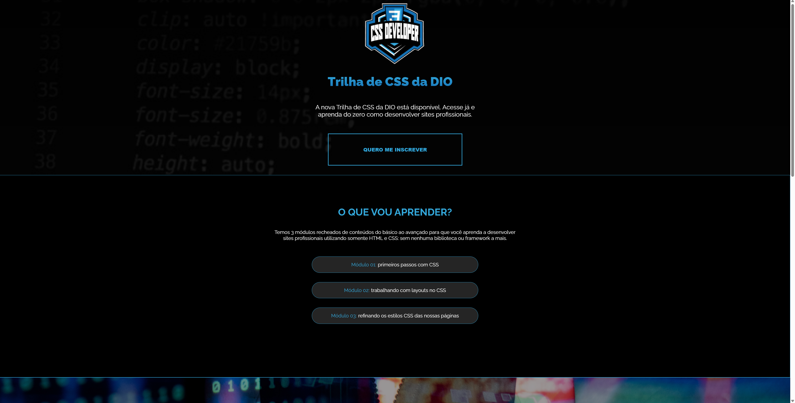
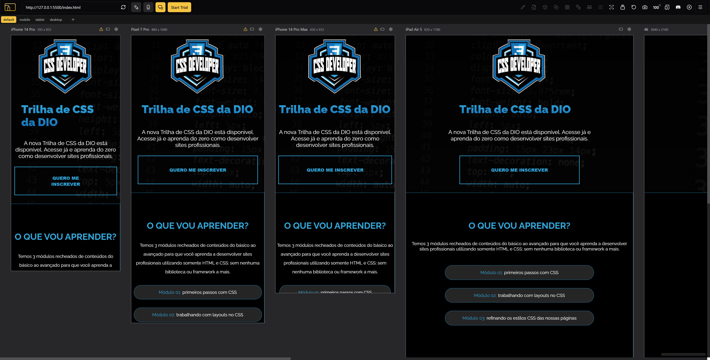

# 🎯 Desafio 01 — Criando sua Primeira Landing Page com HTML e CSS

Bem-vindo(a) ao primeiro desafio da **Trilha de CSS da DIO**!  
Neste projeto você constrói uma **Landing Page completa usando apenas HTML e CSS**, aplicando conceitos fundamentais como:

- Estruturação HTML semântica  
- Estilização com CSS básico  
- Unidades de medida relativas e absolutas  
- Técnicas de tipografia  

## 🔗 Resultado Final (Meu Projeto)

👉 **https://victorrf.github.io/trilha-css-desafio-01/**

## 📌 Sobre o Desafio

O projeto base contém somente as imagens e a estrutura HTML inicial.  
Seu objetivo é **estilizar completamente a página**, seguindo o layout do Figma disponibilizado pela DIO.

Você pode acessar o protótipo oficial aqui: 🎨 [**Figma do Desafio**](https://www.figma.com/file/3PiokoJj9IhGDnNiWAJbz7/DIO---Desafio-01?node-id=2%3A6)

## 🖼️ Preview do Layout Proposto

### Versão para Desktop 💻

### Versões para Mobile e Tablet 📱

## 🧰 Tecnologias Utilizadas

- HTML5
- CSS3

## 🚀 Meu Aprendizado com o Desafio

Durante o desenvolvimento, foi possível praticar:

✔ Organização e semântica HTML; 
✔ Criação de layout responsivo; 
✔ Melhoria visual com espaçamentos, hierarquia e paleta de cores; 
✔ Estrutura de pastas para projetos front-end.

## 📄 Licença

Projeto criado exclusivamente para fins educacionais durante a Trilha CSS da DIO.

Desenvolvido com dedicação por [**victorrf**](https://github.com/victorrf) ✨